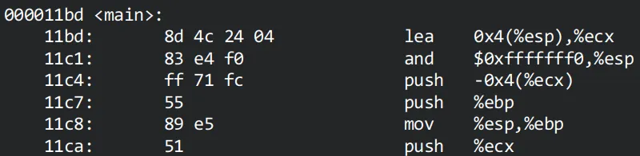
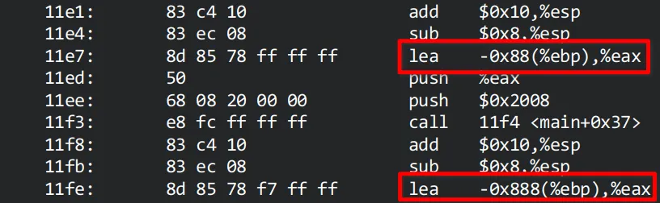
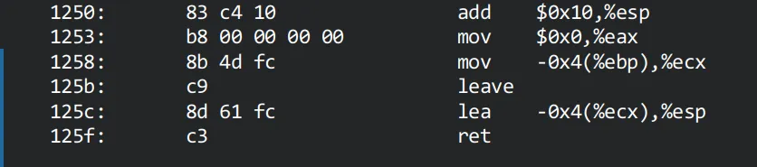

# 缓冲区溢出

本实验利用栈缓冲区溢出实现了劫持控制流，运行 shellcode 并启动了 shell。

## 实验原理及平台介绍

本实验基于 i386 平台进行，运行的操作系统为 Ubuntu 22.04 jammy，内核版本为 x86_64 Linux 5.15.0-102-generic。

对于 i386 平台的函数调用过程，一般的栈帧结构为：

```
+-----------+
|  ret addr |
+-----------+
|  old %ebp |
+-----------+ <---- %ebp
|   local   |
| variables |
+-----------+ <---- %esp
```

对于 local variables，我们可以将其视为函数上下文中的数据缓冲区（data buffer），由于其位于栈上，因此称为栈缓冲区（buffer on stack）。

如果在栈缓冲区写入的数据量超过了 local variables 的范围，即 %ebp - %esp，那么超出写入的数据就会将 old %ebp 和 ret addr 覆盖。

当我们精心构造一个 payload，将其输入给栈缓冲区，使其恰好将 ret addr 覆写为恶意代码的起始地址 ret addr'，那么在函数返回时，ret 指令就会将 %eip 置为 ret addr'，从而开始执行恶意代码。

利用栈缓冲区溢出将 ret addr 覆写为 ret addr'：

```
+-----------+
| ret addr' |
+-----------+
|  XXXXXXXX |
+-----------+ <---- %ebp
|   XXXXX   |
| XXXXXXXXX |
+-----------+ <---- %esp
```

函数返回前的退栈操作：

```
> movl %ebp, %esp
> popl %ebp
+-----------+
| ret addr' |
+-----------+ <---- %esp
|  XXXXXXXX | ----> %ebp = XXXXXXXX
+-----------+
|   XXXXX   |
| XXXXXXXXX |
+-----------+
```

函数返回，ret 指令执行：

```
> ret (equals to `popl %eip`)
+-----------+ <---- %esp
| ret addr' | ----> %eip = ret addr'
+-----------+
|  XXXXXXXX |       %ebp = XXXXXXXX
+-----------+
|   XXXXX   |
| XXXXXXXXX |
+-----------+
```

## 漏洞代码

本实验攻击的漏洞代码为：

```c
#include <stdio.h>
#include <string.h>
#include <stdlib.h>

int main(int argc, char *argv[])
{
	char buf[128];
	char input[2048];
	printf("%p\n", buf);
	printf("%p\n", input);

	if (!fgets(input, sizeof(input), stdin))
		return -1;

	// vulnerable code
	strcpy(buf, input);
}
```

### 代码漏洞分析

漏洞代码的行为是：

1. 从 `stdin` 读取输入到 `input` 中
2. 将 `input` 中的输入拷贝到 `buf` 中

其中，`strcpy` 是漏洞代码，由于 `input` 的长度远大于 `buf`，因此可能会发生缓冲区溢出，是实现攻击的关键。

可以构造 payload，将 shellcode 直接放置在 `input` 中，并利用 `strcpy` 函数将 `input` 头部的数据拷贝到 `buf`，这些头部数据将覆盖栈帧中的返回地址，将控制流转移到 `input` 的 shellcode。

### 攻击准备

1. 通过反汇编查看 `main` 函数的栈帧：



```
> lea 0x4(%esp), %ecx
+-------------+
|   argc      |
+-------------+ <---- %ecx
|  ret addr0  |
+-------------+ <---- %esp

> and $0xfffffff0, %esp
+-------------+
|   argc      |
+-------------+ <---- %ecx
|  ret addr0  |
+-------------+
|    ...      |
+-------------+ <---- %esp (4-byte align)

> push -0x4(%ecx)
> push %ebp
> mov %esp, %ebp
> push %ecx
+-------------+
|   argc      |
+-------------+ <---- %ecx
|  ret addr0  |
+-------------+
|    ...      |
+-------------+
|  ret addr1  |       ret addr1 = ret addr0
+-------------+
|   old ebp   |
+-------------+ <---- %ebp
|    %ecx     |
+-------------+ <---- %esp
```

> 相较于基本栈帧，这里 `main` 函数的栈帧做了 %esp 的对齐和恢复值保存。

2. 获取 `buf` 和 `input` 在栈上的相对位置：



```
+-------------+
|  ret addr1  |       ret addr1 = ret addr0
+-------------+
|   old ebp   |
+-------------+ <---- %ebp
|    %ecx     |
+-------------+
|     ...     |
+-------------+ <---- buf = %esp - 0x88
|     ...     |
|     ...     |
|     ...     |
+-------------+ <---- input = %esp - 0x888
```

3. 查看 `main` 函数的退栈过程：



```
> mov -0x4(%ebp), %ecx
+-------------+
|   argc      |
+-------------+ <---- %ecx
|  ret addr0  |
+-------------+
|    ...      |
+-------------+
|  ret addr1  |
+-------------+
|   old ebp   |
+-------------+ <---- %ebp
|    %ecx     |
+-------------+
|     ...     |
+-------------+ <---- %esp

> leave
> lea -0x4(%ecx), %esp
+-------------+
|   argc      |
+-------------+ <---- %ecx
|  ret addr0  |
+-------------+ <---- %esp
|    ...      |
+-------------+
|  ret addr1  |
+-------------+
|   old ebp   | ----> %ebp
+-------------+
```

`lea -0x4(%ecx), %esp` 这条指令非常关键，它直接决定了 ret 指令的返回地址到底在哪，因此，在设计攻击 payload 时，还需要覆写栈帧中 %ecx 的值，将 %esp 恢复为 ret addr1 的地址。

4. 得到关键栈缓冲区的覆写公式：

  - `%ecx - 0x4 = &ret addr1`，保证 %esp 恢复后指向 ret addr1
  - `ret addr1 = input + 0x104`，保证 ret 指令执行后控制流跳转到 shellcode

其中，`&ret addr = %ebp + 0x4`，`buf = %ebp - 0x88`，`0x104` 是 payload 的头部长度。整理后得到：
  - `%ecx = buf + 0x90`
  - `ret addr1 = input + 0x104`

## 参考

- [cs6265 实验手册](https://tc.gts3.org/cs6265/2021/tut/tut02-warmup2.html)